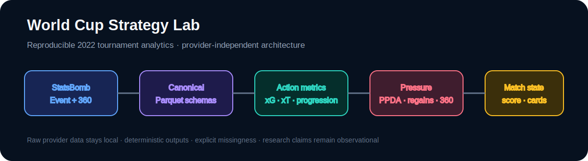
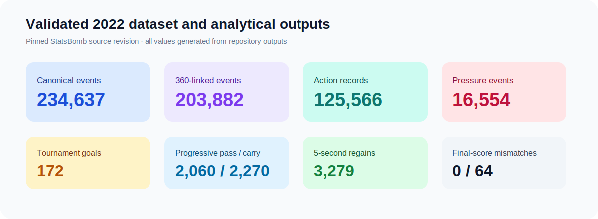
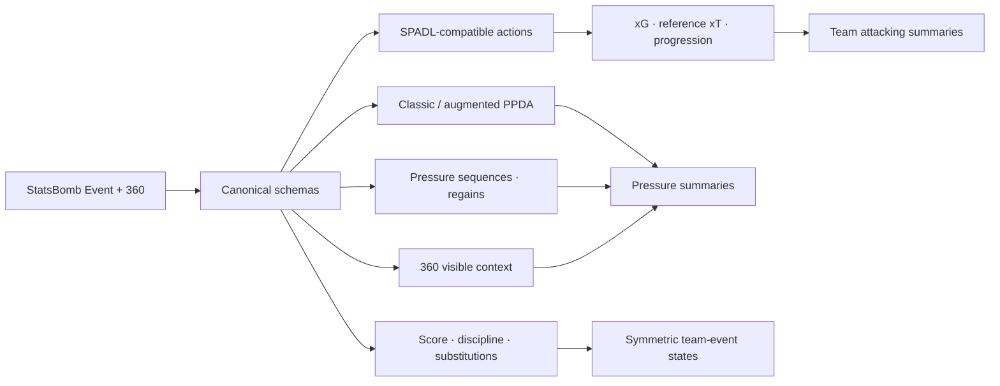

# World Cup Strategy Lab


2022 FIFA World Cup StatsBomb Open Data를 공급자 독립 스키마로 변환하고, 공격·압박·360
맥락·경기 상태를 재현 가능하게 분석하는 연구 코드 저장소입니다. 향후 2026 데이터 공급자를
같은 공통 인터페이스에 연결할 수 있도록 데이터 수집과 분석 계층을 분리했습니다.



## 현재까지 검증된 결과



| 영역 | 실제 검증 결과 |
|---|---:|
| 경기 / 팀 | 64 / 32 |
| 정규 이벤트 | 234,637 |
| 360 연결 이벤트 | 203,882 (86.89%) |
| SPADL-compatible actions | 125,566 |
| 정규 xG 슈팅 | 1,453 |
| 전체 득점 | 172 |
| xT eligible actions | 110,546 |
| Progressive passes / carries | 2,060 / 2,270 |
| StatsBomb Pressure events | 16,554 |
| Pressure sequences | 14,066 |
| 5초 event / sequence regains | 3,279 / 2,801 |
| Team-event state rows | 469,274 |
| 재구성 최종 스코어 불일치 | 0 / 64 |

## 연구 파이프라인



## 구현 마일스톤

- **Milestone 1 — 데이터 기반:** competition 43/season 106 이름 기반 확인, Event·lineup·360
  수집, SHA-256 provenance, Parquet 스키마, coverage 검증.
- **Milestone 2 — 공격 지표:** provider StatsBomb xG, SPADL-compatible actions, 2018 reference
  xT, progressive actions, team-match/tournament 집계.
- **Milestone 3 — 압박과 360:** 표준 classic PPDA와 별도 Pressure-augmented PPDA,
  Pressure sequence, 3/5/8초 regain, counterpress, coverage-aware 360 geometry.
- **Milestone 4 — 경기 상태 (진행 중):** own-goal-safe score reconstruction, discipline,
  substitutions, Tactical Shift, 두 팀 관점 event states까지 완료. 5분 windows와 모델은 미완료.

## 과학적 안전장치

- Shootout은 정규 xG·득점·압박 상태에서 제외합니다.
- StatsBomb의 6개 own-goal 관련 레코드는 3개 득점 사건으로 한 번씩만 반영합니다.
- Reference xT는 2018 World Cup만 학습해 2022 평가 데이터와 분리합니다.
- `Pressure`는 classic PPDA denominator에 포함하지 않습니다.
- Augmented PPDA는 표준 PPDA가 아닌 provider-specific 변형으로 명시합니다.
- 360은 tracking이 아니라 event-linked freeze frame이며, 보이지 않는 선수를 보간하지 않습니다.
- 결측 분석값은 임의로 0으로 바꾸지 않고 null과 reason code를 유지합니다.
- Score event 자체는 득점 전 상태와 득점 후 상태를 모두 보존합니다.

## 주요 문서와 산출물

- [데이터 출처와 provenance](DATA_SOURCES.md)
- [구현 계획](IMPLEMENTATION_PLAN.md)
- [구현 로그](docs/implementation_log.md)
- [지표 정의](docs/metric_definitions.md)
- [2022 데이터 coverage](outputs/reports/data_coverage_2022.md)
- [공격 지표 요약](outputs/reports/attacking_metrics_summary_2022.md)
- [압박 지표 요약](outputs/reports/pressure_metrics_summary_2022.md)
- [Pressure possession alignment](outputs/reports/pressure_possession_alignment_2022.md)

## 재현

시스템 Python 대신 저장소의 uv-managed Python 3.12를 사용합니다. 원시 StatsBomb JSON과
대용량 생성 Parquet은 Git에 포함하지 않습니다.

```bash
UV_CACHE_DIR=.uv-cache ./.tools/uv/uv sync
make fetch-data
make build-data
make validate-data
make milestone-2
make milestone-3
```

품질 게이트:

```bash
PYTHONPATH=src ./.tools/uv/uv run --no-sync ruff check .
PYTHONPATH=src ./.tools/uv/uv run --no-sync ruff format --check .
PYTHONPATH=src ./.tools/uv/uv run --no-sync mypy src
PYTHONPATH=src ./.tools/uv/uv run --no-sync pytest
```

## 한계

현재 분석은 단일 대회 관찰 자료이며 인과 효과를 추정하지 않습니다. xT는 학습 표본과 grid
설정에 민감하고, Pressure·counterpress는 공급자 정의에 의존합니다. 360 coverage는 event
type별로 다르므로 팀 간 맥락 비교에는 coverage를 반드시 함께 보고해야 합니다. Milestone 4의
window-level feature와 score-state regression은 아직 완료되지 않았습니다.

## Attribution

데이터는 [StatsBomb Open Data](https://github.com/statsbomb/open-data)에서 제공되었습니다.
재배포와 출판 시 StatsBomb의 최신 이용·표시 조건을 확인하세요.
